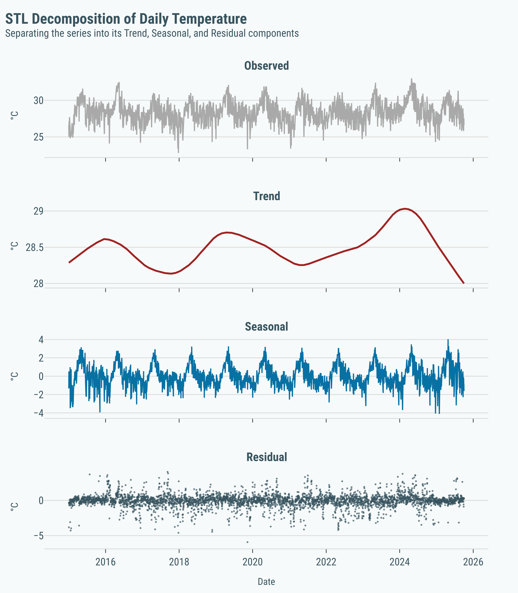
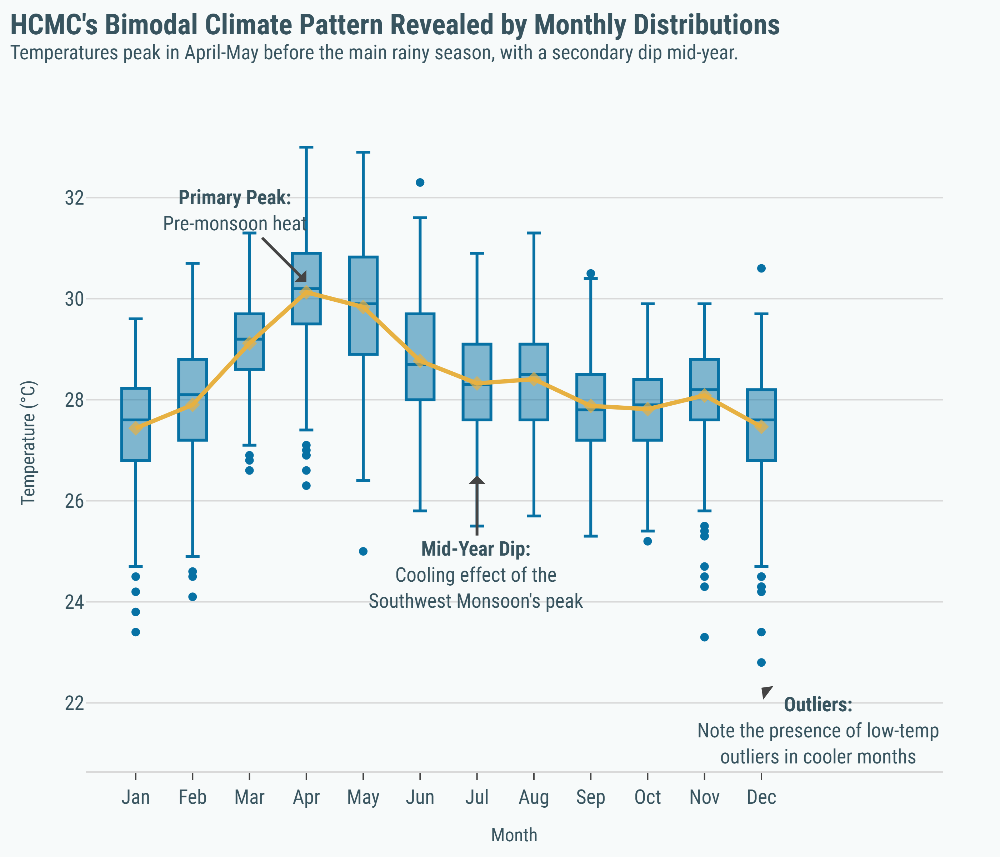
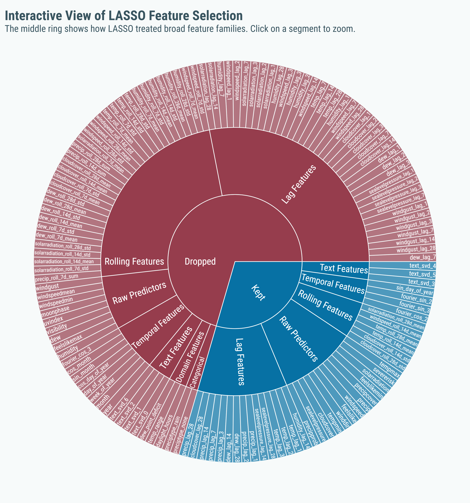
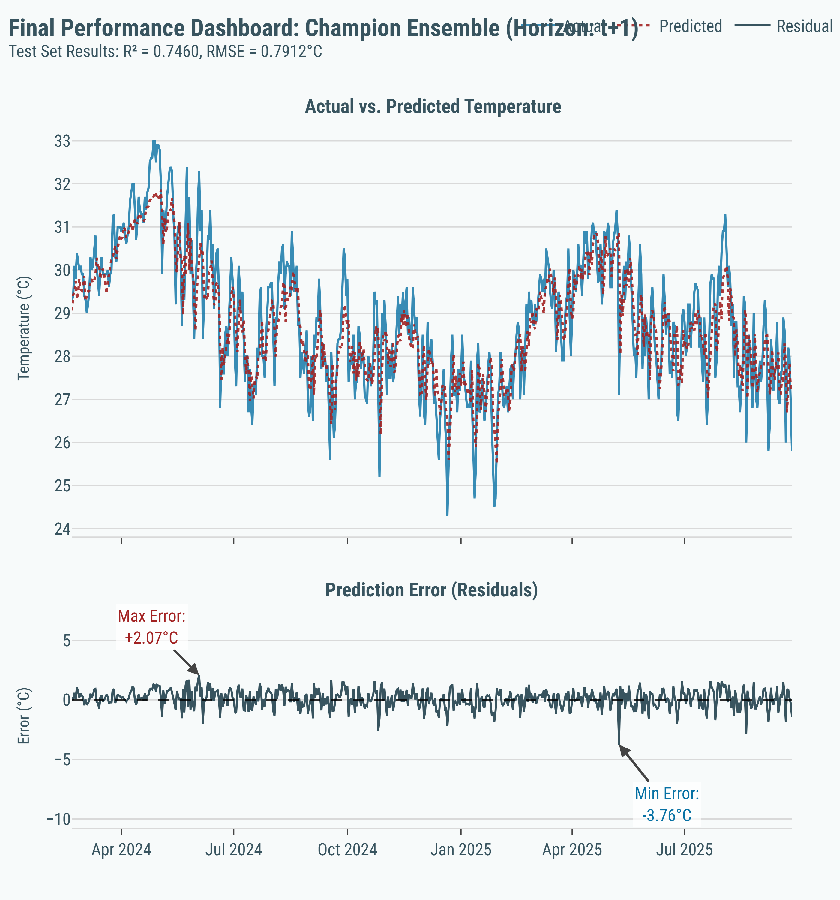
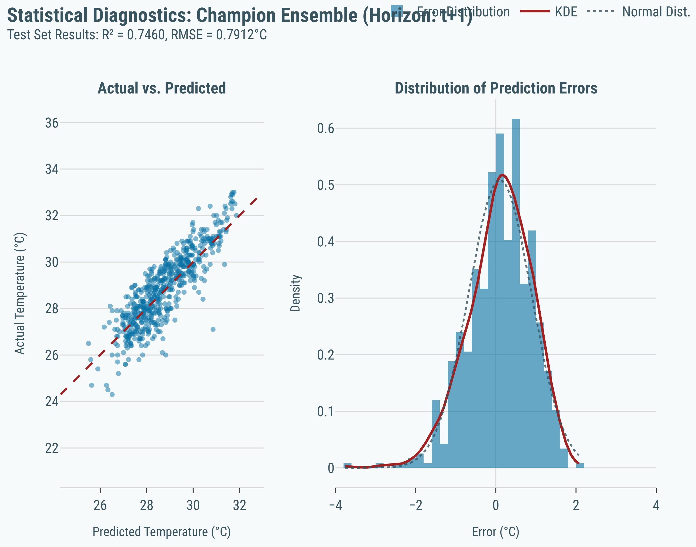
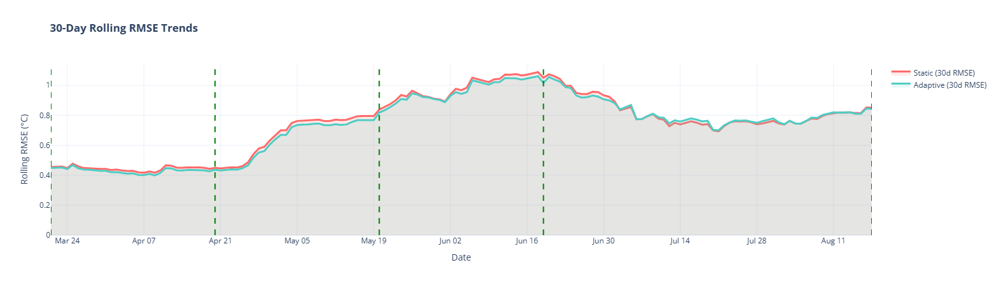

# **Group 2 - Ho Chi Minh city Daily Weather Forecasting**

A rigorous, end-to-end machine learning project to forecast daily temperatures in Ho Chi Minh City, leveraging 10 years of historical weather data.


<br>

<table align="center" border="0" cellpadding="0" cellspacing="0" style="border: none; background-color: transparent;">
  <tbody>
    <tr style="border: none;">
      <td width="25%" align="center" style="padding: 10px; border: none;">
        <a href="https://miles2542.github.io/G2-HCM_city_Weather_Forecasting/" target="_blank">
          <br>
          <b style="font-family: sans-serif;">Live UI Demo</b>
        </a>
      </td>
      <td width="25%" align="center" style="padding: 10px; border: none;">
        <a href="https://rawcdn.githack.com/miles2542/G2-HCM_city_Weather_Forecasting/0e66eab7da6ec2c9bdef52180fc9cd8c74418019/MAIN_PRESENTATION_NOTEBOOK.html" target="_blank">
          <br>
          <b style="font-family: sans-serif;">Full Analysis Notebook</b>
        </a>
      </td>
      <td width="25%" align="center" style="padding: 10px; border: none;">
        <a href="https://github.com/miles2542/G2-HCM_city_Weather_Forecasting.git" target="_blank">
          <br>
          <b style="font-family: sans-serif;">GitHub Repository</b>
        </a>
      </td>
      <td width="25%" align="center" style="padding: 10px; border: none;">
        <a href="https://youtu.be/ipYcgondfPQ" target="_blank">
          <br>
          <b style="font-family: sans-serif;">Watch the Demo</b>
        </a>
      </td>
    </tr>
  </tbody>
</table>

---

## 1. The Challenge: Forecasting a Tropical Monsoon Climate

The project's objective is to forecast the daily average temperature in Ho Chi Minh City for the next five days. A deep exploratory data analysis of a 10-year dataset revealed three critical characteristics of the climate that guided our entire modeling strategy:

*   **1. Strong & Predictable Annual Seasonality:** The data shows a powerful, repeating annual cycle with a bimodal pattern driven by the distinct wet and dry monsoon seasons. This confirmed that cyclical time-based features would be essential.
*   **2. A Long-Term Upward Trend:** Filtering out the seasonal noise reveals a subtle but persistent upward drift in the baseline temperature, indicating a non-stationary series that reflects broader climate trends.
*   **3. Fluctuating Volatility:** Temperature volatility is not constant year-round, with higher variability during the transitional periods between seasons.

These components—a powerful seasonal cycle, a non-linear trend, and short-term noise—established the feature engineering requirements for any successful model.

<p align="center">
  
  <br>
  <em>STL decomposition visually confirming the Trend, Seasonal, and Residual components of the temperature time series.</em>
</p>
<p align="center">
  
  <br>
  <em>The bimodal monsoon cycle: a primary peak in heat (Apr-May) before the rainy season, and a cooler period (Dec-Jan) during the dry season.</em>
</p>

## 2. Methodology: From Raw Data to a Champion Model

Our approach prioritized a rigorous, evidence-based workflow at every stage, from feature engineering to hyperparameter optimization and final model selection.

### 2.1. Feature Engineering

We engineered a comprehensive set of **139 features** from the raw daily data to explicitly provide the model with signals for trend, seasonality, and recent history. Key feature families include:
*   **Temporal:** `year`, `month`, `day_of_year`
*   **Cyclical:** Sine/Cosine transformations to model the cyclical nature of days and months.
*   **Lag Features:** Values from previous time steps (e.g., temperature from `t-1`, `t-7`, `t-28` days).
*   **Rolling Window Features:** Statistics (e.g., `mean`, `std`) over various windows (e.g., 7-day, 28-day) to capture momentum.
*   **Text-Based Features:** Latent topics extracted from weather descriptions using a TF-IDF + SVD pipeline.

To address severe multicollinearity for linear models, `MultiTaskLassoCV` was used to select a parsimonious subset of **41 features**.

<p align="center">
  
  <br>
  <em>Sunburst chart visualizing LASSO's aggressive pruning, primarily on redundant Lag and Rolling Window features.</em>
</p>

### 2.2. Model Selection & Optimization

The modeling process followed a systematic bake-off and refinement strategy:
1.  **Initial Surprise:** An initial model comparison revealed that simple, regularized linear models (`RidgeCV`) outperformed complex, untuned tree-based models (`LGBM`, `CatBoost`). We hypothesized this was due to our feature engineering having already linearized the data.
2.  **Unlocking Potential with HPO:** A massive hyperparameter optimization campaign was conducted using **Optuna**. By systematically tuning a separate set of optimal hyperparameters for each of the 5 forecast horizons, we achieved a dramatic performance lift in the tree-based models.
3.  **The Rise of Ensembles:** The final breakthrough came from ensembling. A simple, horizon-specific weighted average of our best linear model (`RidgeCV`) and our best tuned tree model (`Tuned_LGBM`) consistently outperformed any single model in cross-validation.

This process yielded our champion model, `WeightedAvg_Ridge_TunedLGBM`, which combines the stability of a linear model with the pattern-capturing power of a finely-tuned gradient boosting tree.

| Rank   | Model                   | Model Family       | Avg CV R² ↑ | Avg CV RMSE ↓ |
| :----- | :---------------------- | :----------------- | :---------- | :------------ |
| **#1** | **Avg_Ridge_TunedLGBM** | **Tuned Ensemble** | **0.4371**  | **0.9432**    |
| #2     | Avg_Ridge_TunedCatBoost | Tuned Ensemble     | 0.4331      | 0.9463        |
| #5     | RidgeCV                 | Linear             | 0.4219      | 0.9570        |
| #7     | SimpleAveragingEnsemble | Untuned Ensemble   | 0.4175      | 0.9587        |

*Abbreviated cross-validation leaderboard showing the victory of the tuned ensemble.*

## 3. Final Performance: Unbiased Test Set Evaluation

The champion (`Ensemble`) and a powerful, simpler alternate (`RidgeCV`) were trained on the full training dataset and evaluated **exactly once** on a held-out, unseen test set to provide a final, unbiased measure of their real-world performance.

The ensemble model consistently outperformed the alternate across every forecast horizon, achieving a final average **RMSE of 0.9665°C** and explaining nearly **62% of the temperature variance** on unseen data.

| Horizon     | Ensemble (R²) | RidgeCV (R²) | Ensemble (RMSE) | RidgeCV (RMSE) | Ensemble (MAE) | RidgeCV (MAE) |
| :---------- | :------------ | :----------- | :-------------- | :------------- | :------------- | :------------ |
| t+1         | **0.7460**    | 0.7396       | **0.7912**      | 0.8010         | **0.6265**     | 0.6324        |
| t+2         | **0.6306**    | 0.6232       | **0.9555**      | 0.9651         | **0.7628**     | 0.7725        |
| t+3         | **0.5805**    | 0.5748       | **1.0195**      | 1.0264         | **0.8130**     | 0.8144        |
| t+4         | **0.5689**    | 0.5658       | **1.0336**      | 1.0374         | **0.8225**     | 0.8231        |
| t+5         | **0.5711**    | 0.5648       | **1.0325**      | 1.0401         | **0.8246**     | 0.8299        |
| **Average** | **0.6194**    | 0.6136       | **0.9665**      | 0.9740         | **0.7699**     | 0.7745        |

<p align="center">
  
  <br>
  <em>Champion model's t+1 predictions (red dotted line) tracking the actual temperature (blue line) on the unseen test set.</em>
</p>
<p align="center">
  
  <br>
  <em>Diagnostic plots confirming the model is well-calibrated (left) and that its errors are unbiased and approximately normally distributed (right).</em>
</p>


## 4. MLOps in Practice: Simulating Model Maintenance

A model's performance is not static; it degrades over time as real-world conditions evolve. To address this, we designed and simulated an intelligent retraining strategy to answer the question from the project brief: **"When should the model be retrained?"**

### 4.1. The Drift Detection System

We developed a robust `EnsembleDriftDetector` that monitors for three types of model drift and operates on a 3-tier priority system:

| Priority     | Trigger Condition                                                                                                                              | Rationale                                                                                                 | Action                |
| :----------- | :--------------------------------------------------------------------------------------------------------------------------------------------- | :-------------------------------------------------------------------------------------------------------- | :-------------------- |
| 🔴 **HIGH**   | **Severe Performance Degradation:** A sudden, unacceptable drop in accuracy (e.g., RMSE spikes >50%).                                          | Reacts immediately to critical model failure.                                                             | **Immediate Retrain** |
| 🟡 **MEDIUM** | **Combined Distributional Drift:** The statistical properties of *both* the input features and the target variable have significantly changed. | Proactively retrains before performance drops, but requires corroborating evidence to avoid false alarms. | **Proactive Retrain** |
| 🟢 **LOW**    | **Scheduled Maintenance:** The model has not been retrained for an extended period (e.g., 90 days).                                            | Acts as a safety net to ensure the model never becomes excessively stale.                                 | **Scheduled Retrain** |

### 4.2. Simulation Results

We compared two strategies over a 180-day test window:
1.  **Static Model:** Deployed once and never retrained.
2.  **Adaptive Model:** Monitored every 30 days and retrained if the drift detector's conditions were met.

The results were definitive. The adaptive strategy, which retrained 5 times in response to detected drift, consistently outperformed the static model. It achieved a **+1.56% reduction in RMSE** and a **+2.81% relative improvement in R²**.

<p align="center">
  
  <br>
  <em>The 30-day rolling RMSE of the static (red) vs. adaptive (teal) models. The adaptive model's error is consistently suppressed, especially after the retraining events (green dashed lines), proving the effectiveness of the drift detection policy.</em>
</p>

This simulation confirms that a proactive, event-driven retraining policy is superior to a simple, fixed schedule, justifying the overhead of a monitoring system.

## 5. Repository Structure

This repository contains the full source code, data, models, and analysis for the project.

```
.
├── MAIN_PRESENTATION_NOTEBOOK.ipynb  # The main Jupyter notebook with the full analysis.
├── ui/                               # Source code for the live HTML/JS UI demo.
├── utils/                            # Reusable Python modules for training, evaluation, drift detection, etc.
├── assets/                           # Saved artifacts: models, HPO studies, plots, evaluation results.
├── data/                             # The raw daily and hourly weather datasets.
├── requirements.txt                  # Required Python packages.
└── README.md                         # You are here.
```

## 6. Setup & Usage

To replicate the analysis, follow these steps:

1.  **Clone the repository:**
    ```bash
    git clone https://github.com/miles2542/G2-HCM_city_Weather_Forecasting.git
    cd G2-HCM_city_Weather_Forecasting
    ```

2.  **Create a virtual environment and install dependencies:**
    ```bash
    python -m venv venv
    source venv/bin/activate  # On Windows, use `venv\Scripts\activate`
    pip install -r requirements.txt
    ```

3.  **Run the Jupyter Notebook:**
    Launch Jupyter and open `MAIN_PRESENTATION_NOTEBOOK.ipynb`. The notebook is designed to load pre-computed results from the `assets/` folder by default to save time, but all training and HPO code can be re-run by changing the configuration flags at the top of the notebook.
